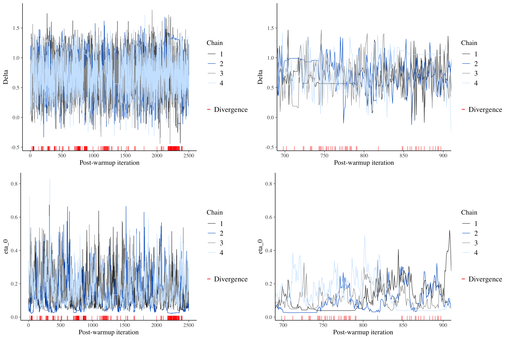

```{r setup, include=FALSE}
knitr::opts_chunk$set(echo = TRUE, out.height = "500px", dpi = 300, fig.align = "center", fig.width = 7, fig.height = 5)
knitr::opts_knit$set(root.dir = here::here())
library(tidyverse)
theme_set(theme_light())
library(ggeffects)
library(lme4)
library(brms)
library(tidybayes)
library(bayesplot)
options(htmltools.dir.version = FALSE)
xaringanExtra::use_xaringan_extra(c("panelset", "tachyons"))
```

```{r mald, echo=FALSE}
mald <- readRDS("./data/mald.rds")
```

# All about the Bayes

- Within the NHST (Frequentist) framework, the main analysis output is:

  - **Point estimates** of predictors' parameters (with standard error).
  - **P-values**.

- Within the Bayesian framework, the main analysis output is:

  - **Probability distributions** of predictors' parameters.

---

# All about the Bayes

Images of NHST vs Bayes output.

---

# An example

[Massive Auditory Lexical Decision](https://aphl.artsrn.ualberta.ca/?page_id=827) (Tucker et al. 2019):

- **MALD data set**: 521 subjects, RTs and accuracy.

- Subset of MALD: 30 subjects, 100 observations each.

--

```{r mald-print}
mald
```


---

# A frequentist linear model

```{r lm-1}
lm_1 <- lmer(
  log(RT) ~
    PhonLev +
    IsWord +
    PhonLev:IsWord +
    (1 | Subject),
  data = mald
)
```

---

# A frequentist linear model

```{r lm-1-sum, echo=FALSE}
summary(lm_1, correlation= FALSE)
```

---

# A frequentist linear model

```{r lm-1-pred, echo=FALSE, message=FALSE}
ggpredict(lm_1, terms = c("PhonLev", "IsWord")) %>%
  plot()
```

---

# Increase model complexity

**Try it yourself!** Does it work?

```{r lm-2, eval=FALSE}
lm_2 <- lmer(
  log(RT) ~
    PhonLev +
    IsWord +
    PhonLev:IsWord +
    (PhonLev + IsWord | Subject),
  data = mald
)
```

--

```{r lm-2-run, echo=FALSE}
lm_2 <- lmer(
  log(RT) ~
    PhonLev +
    IsWord +
    PhonLev:IsWord +
    (PhonLev + IsWord | Subject),
  data = mald
)
```

---

# A Bayesian linear model

```{r brm-1, eval=FALSE}
brm_1 <- brm(
  RT ~
    PhonLev +
    IsWord +
    PhonLev:IsWord +
    (PhonLev + IsWord | Subject),
  data = mald,
  # Let's use a lognormal fam, rather than log the RT values
  family = lognormal()
)
```

```{r brm-1-run, echo=FALSE}
brm_1 <- brm(
  RT ~
    PhonLev +
    IsWord +
    PhonLev:IsWord +
    (PhonLev + IsWord | Subject),
  data = mald,
  # Let's use a lognormal fam, rather than log the RT values
  family = lognormal(),
  # Technical stuff
  backend = "cmdstanr",
  cores = 4,
  threads = threading(2),
  file = "data/rds/brm_1"
)
```

---

# A Bayesian linear model

.medium[
```{r brm-1-sum, echo=FALSE, warning=FALSE}
brm_1
```
]

---

# A Bayesian linear model

```{r brm-1-cond, echo=FALSE}
conditional_effects(brm_1, effects = "PhonLev:IsWord")
```

---

# Let's start small

**Try it yourself!**

```{r brm-2}
brm_2 <- brm(
  RT ~
    IsWord,
  data = mald,
  family = lognormal(),
  # Save model output to file
  file = "./data/rds/brm_2.rds"
)
```

---

class: center middle reverse

.f1[[MCMC what?](https://chi-feng.github.io/mcmc-demo/app.html)]

???

More on MCMC: http://elevanth.org/blog/2017/11/28/build-a-better-markov-chain/

---

# Let's start small

.pull-left[
```{r brm-2-explain, eval=FALSE}
brm_2 <- brm(
  RT ~
    IsWord,
  data = mald,
  # Probability distribution
  # of the OUTCOME
  family = lognormal(),
  # TECHNICAL STUFF
  # Save model output
  # to file
  file = "./data/rds/brm_2.rds",
  # Number of chains
  chains = 4, 
  # Number of iterations per
  # chain
  iter = 2000,
  # Number of cores to use
  cores = 4
)
```
]

--

.pull-right[
- `chains`: Number of MCMC chains to be run.

- `iter`: Number of iterations per MCMC chain.

- `cores`: Number of cores to use for running the MCMC chains.

  - You can find out how many cores your laptop has with `parallel::detectCores()`
]

---

# Let's start small

.big[
```{r brm-2-sum}
brm_2
```
]

---

# Quick plot

```{r brm-2-plot}
plot(brm_2)
```

---

# Get variables

To list all variable names in a model, use:

```{r brm-2-vars}
variables(brm_2)
```

---

# Get MCMC draws

You can easily extract the MCMC draws:

```{r brm-2-draws}
brm_2 %>%
  gather_draws(`b_.*`, regex = TRUE)
```


---

# Posterior distributions

Now you can plot the draws using ggplot2.

```{r brm-2-int-g}
g_1 <- brm_2 %>%
  gather_draws(b_Intercept) %>%
  ggplot(aes(.value)) +
  stat_halfeye(fill = "#214d65") +
  scale_x_continuous(breaks = seq(6, 7, by = 0.01)) +
  labs(title = "Intercept")
```

---

# Posterior distributions

```{r brm-2-int, echo=FALSE}
g_1
```


---

# Posterior distributions

```{r brm-2-isword-g}
g_2 <- brm_2 %>%
  gather_draws(b_IsWordFALSE) %>%
  ggplot(aes(.value)) +
  stat_halfeye(fill = "#624B27") +
  scale_x_continuous(breaks = seq(0, 1, by = 0.01)) +
  labs(title = "Effect of IsWord = FALSE")
```

---

# Posterior distributions

```{r brm-2-isword, echo=FALSE}
g_2
```


---

# MCMC chains diagnostics

```{r brm-2-chain-1, message=FALSE}
as.array(brm_2) %>%
  mcmc_trace("b_IsWordFALSE", np = nuts_params(brm_2))
```


---

# MCMC chain divergences

.center[

]

???

Picture from <https://www.rdatagen.net/post/diagnosing-and-dealing-with-estimation-issues-in-the-bayesian-meta-analysis/>.

---

# $\hat{R}$ and Effective Sample Size

```{r brm-2-diag}
brm_2
```

---

# Interpret the output
